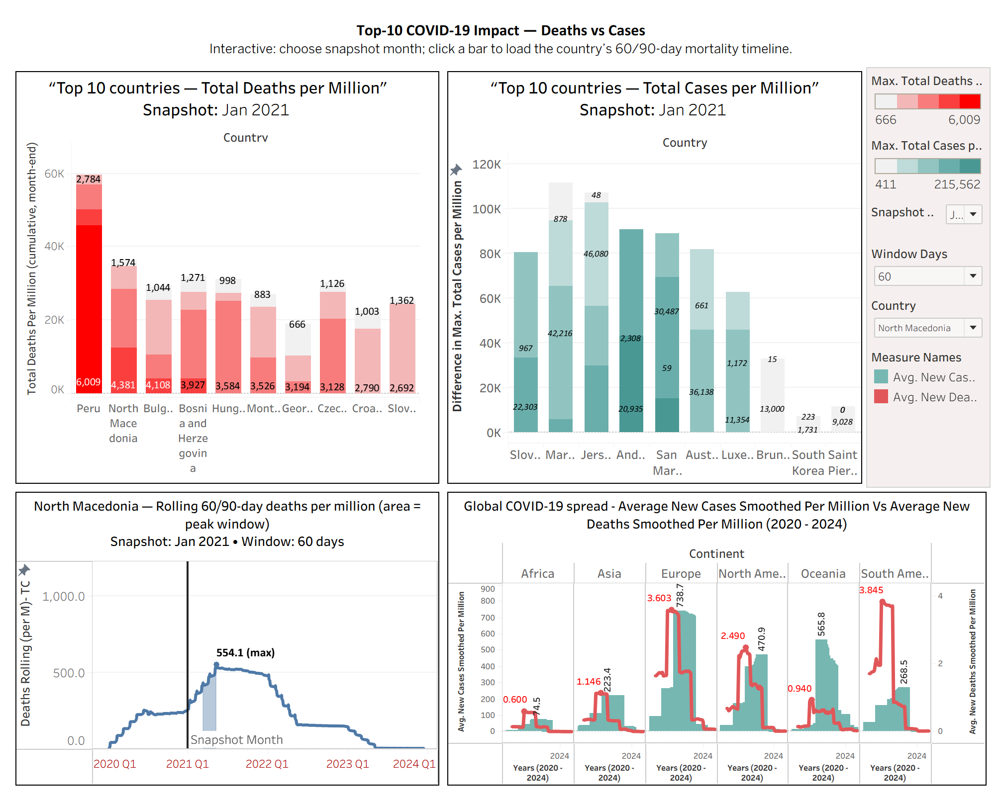

# COVID-19: Where Was It Worst? — A Data Journalism Project

Short, visual story on how COVID-19 evolved globally (**2020–2024**): temporal patterns, regional disparities, the role of vaccination, and policy stringency. Built with Tableau (TWBX) using the Our World in Data (OWID) COVID-19 dataset.

## TL;DR
- **Deaths peaked in 2021**, cases peaked in **2022 (Omicron)**; severity fell as vaccination & treatments improved.
- **South America & parts of Europe** had the highest deaths per-million; **Oceania** saw lower outcomes under stricter border controls.
- **Higher vaccination** ↔ **lower death-to-case ratios** (associative).
- **Policy stringency** shows a complex, time-dependent relationship with outcomes (association, not causation).

## Repository Structure
- `images/` → README hero/screenshots  
- `reports/` → Slide deck (PDF)  
- `tableau/` → Packaged workbook (`.twbx`)  
- `LICENSE` → MIT  
- `README.md` → this file

## Data Source
**Our World in Data (OWID) — COVID-19 dataset**  
GitHub: [owid/covid-19-data](https://github.com/owid/covid-19-data)

**Fields used (examples):**
- `new_cases_smoothed_per_million`, `new_deaths_smoothed_per_million`
- vaccination coverage (e.g., `people_fully_vaccinated_per_hundred`)
- policy `stringency_index`
- (where available) hospital/ICU signals from OWID’s ancillary tables

**Window covered:** Jan 2020 – Dec 2024  
**Attribution:** Data compiled and maintained by **Our World in Data (OWID)**, licensed under **[CC BY 4.0](https://creativecommons.org/licenses/by/4.0/)**.

## How to View the Dashboard
1. Download the TWBX from **`tableau/`** and open with Tableau Desktop or Tableau Public (Desktop).  
   → [`tableau/Project2_DataJournalism_Covid_WorkingSheet_MyoMyintAungJimmy_Final.twbx`](tableau/Project2_DataJournalism_Covid_WorkingSheet_MyoMyintAungJimmy_Final.twbx)
2. Read the short slide deck (PDF) in **`reports/`**:  
   → [`reports/Where-is-the-Coronavirus-Situation-the-Worst.pdf`](reports/Where-is-the-Coronavirus-Situation-the-Worst.pdf)
3. Use the filters to explore **Global Trends**, **Regional Comparisons**, **Temporal Patterns**, and **Policy Impact**.

## Methods (Brief)
- **Per-million normalization** for cross-country comparability.
- **7-day smoothing** for daily series to reduce reporting noise/weekend effects.
- **Monthly aggregates** for year-over-year and quarterly comparisons where appropriate.
- **Snapshot & rolling windows:** “Top-10” views use a **snapshot month**; country deep-dives use **rolling 60/90-day deaths per-million** to characterize peak windows.
- **Continental roll-ups** for high-level comparisons; example countries (e.g., Peru, Bulgaria, Brazil, Hungary, UK, USA, India, Singapore, North Macedonia) illustrate different patterns.
- **Annotation-first design:** captions explain how to read each chart; emphasis on **rates** (not cumulative totals).

## Notes & Limits
- **Data quality varies** by country & period (testing/reporting regime changes, backfills, reclassifications).
- **Cases vs deaths are not directly comparable** across places or waves (testing access, age structure, variants, healthcare strain differ).
- **Stringency is associative, not causal**; high values can coincide with **worsening outbreaks** (policy response) as well as suppression (policy effect).
- **Small populations are volatile** in per-million charts; interpret spikes with caution.
- **Late 2023–2024:** many regions scaled back testing & reporting; apparent declines may partially reflect reduced surveillance.
- **Hospital/ICU metrics** are not uniformly available across countries and time.

## License
Code/content in this repo is released under the **MIT License** (see `LICENSE`).  
Data © **Our World in Data**, used under **CC BY 4.0**.
